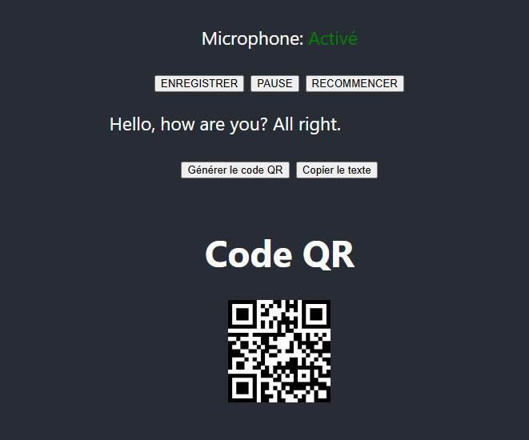

# Speech-to-Text with QR Share – React App



## Description

This React application converts speech to text in real-time using the Web Speech API.  
It also offers convenient sharing options, including generating a QR code for the transcribed text and a one-click copy to clipboard feature.

## Features

✅ Real-time speech-to-text conversion  
✅ Copy transcribed text to clipboard  
✅ Generate and display QR code for easy sharing  
✅ Clean, responsive UI built with React  

## Project Setup

```bash
$ npm install
```

## Run the Project

```bash
# development mode
$ npm run start

# build for production
$ npm run build

# preview production build locally
$ npm run preview
```

## Running Tests (if set up)

```bash
# run tests
$ npm run test
```

## Deployment

To deploy the app, first build it:

```bash
$ npm run build
```

You can then host the `dist` or `build` folder on platforms like **Netlify**, **Vercel**, or any static hosting service.

## Useful Resources

- [React Documentation](https://react.dev)  
- [Web Speech API (MDN)](https://developer.mozilla.org/en-US/docs/Web/API/Web_Speech_API)  
- [QRCode.react Library](https://github.com/zpao/qrcode.react) (or your chosen QR package)  
- [React Clipboard API](https://developer.mozilla.org/en-US/docs/Web/API/Clipboard_API)  

## License

This project is licensed under the [MIT License](LICENSE).

---

If you use or extend this project, feel free to contribute or give feedback!
